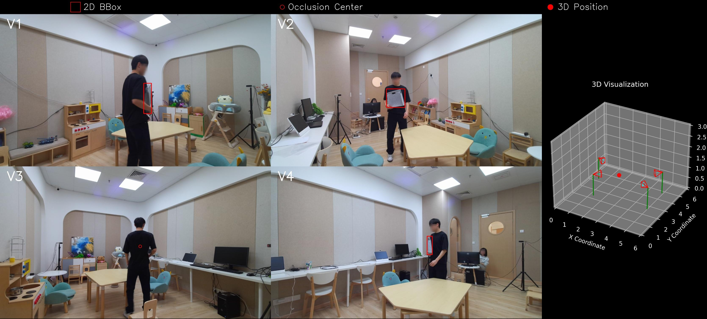

# :star2: [CVPR'2025 Highlight] - MITracker

<!--[Mengjie Xu](https://xum007.github.io/), [Yitao Zhu](https://absterzhu.github.io/), Haotian Jiang, Jiaming Li, [Zhenrong Shen](https://zhenrongshen.github.io/), [Sheng Wang](http://shengwang.link/), [Haolin Huang](https://scholar.google.com/citations?user=Hr87lqsAAAAJ&hl=zh-CN), Xinyu Wang, Qing Yang, Han Zhang, [Qian Wang](https://qianwang.space/) -->

The official implementation for the CVPR 2025 paper [[MITracker: Multi-View Integration for Visual Object Tracking](https://arxiv.org/pdf/2502.20111)].

[[Project Page](https://mii-laboratory.github.io/MITracker/)]

https://github.com/user-attachments/assets/37eeaa24-2788-4a89-927c-85184899a7eb


## Data Preparation
Please complete [this form](https://docs.google.com/forms/d/e/1FAIpQLSeFml5oIyIKT-R8Biw4aGClNeFhgakRE1dXVIbRIbst7uEMaQ/viewform?usp=header) to request authorization for the non-commercial use of **MVTrack**. Once submitted, you will receive an email containing the download links to access the 80GB dataset. 

Place the tracking datasets and organize the data in the following format:

```
./data
├── MVTrack/
    ├── ashbin1/
    │   ├── ashbin1-1/
    │   │   ├── img
    │   │   ├── attributes.json     # frame level target attributes
    │   │   ├── groundtruth.txt     # x, y, w, h
    │   │   └── invisible.txt       # fully occlusion or out-of-view
    │   ├── ashbin1-2/
    │   ├── ...
    │   └── BEV/
    │       └── xyz_index.txt       # x: [-4000, 4000] (mm), y: [-4000, 4000] (mm), z: [-50, 2950] (mm), voxel indices 
    ├── ashbin3
    ├── bag1
    ├── basketball5
    ...
    ├── calibs.json                 # camera intrinsics and extrinsics (mm)
    ├── test_split.txt
    ├── train_split.txt
    └── val_split.txt
├── got10k/
    ├── test
    ├── train
    └── val
```

Below is an example of the annotations provided by the **MVTrack** dataset.
<p align="center">
  
</p>

<!--https://github.com/user-attachments/assets/18bba035-9237-482e-bf24-a9f574fffe3f
https://github.com/user-attachments/assets/e1b05a21-d95c-4b36-a953-01adb935cc80 -->

## Environment 

### Installation
```
conda create -n mitracker python=3.9
conda activate mitracker
bash install.sh
```


### Set project paths
Run the following command to set paths for this project
```
python tracking/create_default_local_file.py --workspace_dir . --data_dir /data --save_dir ./output
```
After running this command, you can also modify paths by editing these two files
```
lib/train/admin/local.py  # paths about training
lib/test/evaluation/local.py  # paths about testing
```


## Training
Download pre-trained [DINOv2 ViT-Base weights](https://dl.fbaipublicfiles.com/dinov2/dinov2_vitb14/dinov2_vitb14_pretrain.pth) and put it under `$PROJECT_ROOT$/pretrained_networks`.

### First stage

Train the view-specific feature extraction module using single-view inputs from MVTrack and got10k datasets.
```
python tracking/train.py --script mitracker_stage1 --config baseline --save_dir ./output --mode multiple --nproc_per_node 2
```

Replace `--config` with the desired model config under `experiments/mitracker_stage1`.

### Second stage

To enable multi-view integration module training, replace `experiments/mitracker/*.yaml` PRETRAIN_PTH in the yaml configuration file with the path to your pretrained checkpoint, such as './output/checkpoints/train/mitracker_stage1/baseline/MITrackerStage1_ep0050.pth.tar'.

```
python tracking/train.py --script mitracker --config baseline --save_dir ./output --mode multiple --nproc_per_node 2
```

## Evaluation

### Test
MVTrack, GMTD or other off-line evaluated benchmarks (modify `--dataset` correspondingly)
- `mvtrack_sot_test` for single-view test, `mvtrack_mot_test` for multi-view test
```
python tracking/test.py mitracker_stage1 baseline --dataset mvtrack_sot_test --runid 50 --threads 8 --num_gpus 2 --restart 0
python tracking/test.py mitracker baseline --dataset mvtrack_mot_test --runid 40 --threads 8 --num_gpus 2 --restart 0
python tracking/analysis_results.py # need to modify tracker configs and names
```

### Test FLOPs, and Speed
*Note:* The speeds reported in our paper were tested on a single NVIDIA A100.

```
python tracking/profile_model.py --script mitracker --config baseline
```


## Acknowledgments
* Thanks to the [ODTrack](https://github.com/GXNU-ZhongLab/ODTrack) and [TrackTacular](https://github.com/tteepe/TrackTacular) libraries for enabling quick implementation of our ideas.


## Citation

If any parts of our paper and code help your research, please consider citing us and giving a star to our repository.

```
@article{xu2025mitracker,
  title={MITracker: Multi-View Integration for Visual Object Tracking},
  author={Xu, Mengjie and Zhu, Yitao and Jiang, Haotian and Li, Jiaming and Shen, Zhenrong and Wang, Sheng and Huang, Haolin and Wang, Xinyu and Yang, Qing and Zhang, Han and others},
  journal={arXiv preprint arXiv:2502.20111},
  year={2025}
}
```
